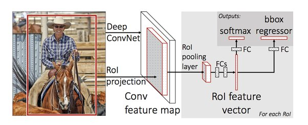

# Vehicle Damage Detector


# Aim
### To build a custom that can detect the area of damage on a vehicle.
Insurance Companies can use this models to speedup the claim settlement process based on the user insurance claim images.


# Mask R-CNN
### Fast R-CNN uses Selective Search on the layers of the CNN itself to identify Region Proposals. Faster R-CNN uses an object detection algorithm that allows the CNN itself to learn the Region Proposals.
Mask R-CNN, extends Faster R-CNN by adding a branch for predicting an object mask in parallel with the existing branch for bounding box recognition. Mask R-CNN is an instance segmentation model that allows identifying pixel wise location for predefined class. Mask R-CNN is different from classical object detection models like Faster R-CNN where, in addition to identifying the class and its bounding box location, it can also color pixels in the bounding box that correspond to that class.



## 1. Data Collection
The dataset is made up of 194 images (177 train + 11 validation + 6 test) from the internet.

Sample Image 1             |   Sample Image 2
:-------------------------:|:-------------------------:
       |  

## 2. Data Annotation
The images were ananotated using the roboflow and saved in the POV xml format.
A Mask R-CNN model requires the images in training dataset to be annotated, which is to have the region of damage in an image identified and the boundary of the damaged area marked accurately.
Link to annotation tool https://app.roboflow.com. The annotations is then saved as a json format file in the [dataset](/Annotation) directory.

## 3. Import dataset and Visualization

Visualization of mask on the annotated image is done in [car-damage-detection.ipynb](car-damage-detection.ipynb)

   

   


## 4. Training model
The model is trained using the Detecto Library.


can run it directly from the Hugging Face Spaces:
https://huggingface.co/spaces/lakshmi324/Vehicle_Damage_Detector

## Installation
1. Clone this repository
2. Install dependencies
   ```bash
   pip3 install -r requirements.txt
   ```
3. Run setup from the repository root directory
    ```bash
    python3 setup.py install
    ```

4.Run the app.py to get the predictions.
